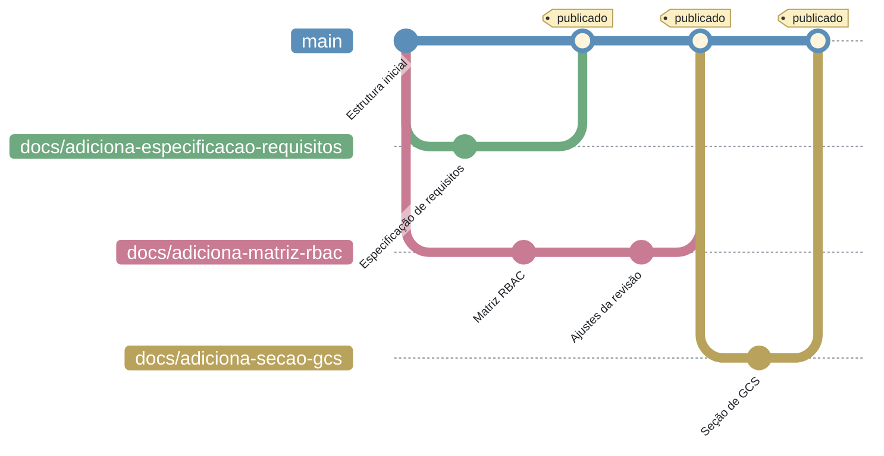

<h1 align="center">Gerenciamento de Documentação</h1>


<p align="center">O histórico de alterações consolidado está na <a href="../">página inicial da seção de GCS</a>.</p>

## Sumário

- [1. Introdução](#introducao)
- [2. Modelo de ramificação da documentação](#ramificacao)
- [3. Branches](#branches)
- [4. Padronização da nomenclatura das branches](#nomenclatura-branch)
- [5. Quando abrir uma issue](#issue)
- [6. Fluxo de trabalho](#fluxo)
- [7. Pull Request e revisão](#pull-request)
- [8. Nomenclatura e organização dos arquivos](#nomenclatura-arquivos)
- [9. Versionamento dos documentos](#versionamento)
- [10. Atualização e manutenção](#manutencao)

---

<a id="introducao"></a>

## 1. Introdução

Esta seção estabelece a organização, a padronização, o versionamento e a rastreabilidade dos artefatos documentais do projeto. A documentação é considerada parte integrante do produto de software e deve ser mantida atualizada ao longo de todo o ciclo de desenvolvimento.

A documentação do Notifica Saúde é mantida em repositório próprio, escrita em Markdown e publicada como site estático pelo **MkDocs**. Por ser versionada em Git, ela segue um modelo de ramificação próprio, mais simples que o GitFlow adotado nos repositórios de código: não há branch de integração nem ciclo de release, porque cada alteração aprovada é publicada imediatamente.

!!! warning "Modelo distinto do GitFlow"
    O [modelo de ramificação](modelo-ramificacao.md) descrito para os repositórios de código **não se aplica** ao repositório de documentação. Aqui valem as regras desta página.

---

<a id="ramificacao"></a>

## 2. Modelo de ramificação da documentação

Toda alteração na documentação parte da `main`, é desenvolvida em uma branch `docs/<descrição>` e retorna à `main` por Pull Request, após revisão. O merge na `main` dispara a publicação do site.



As branches de documentação são independentes entre si: cada uma parte da `main` e retorna a ela sem passar por nenhuma branch intermediária. Duas branches podem coexistir, como no exemplo acima, desde que tratem de artefatos distintos.

---

<a id="branches"></a>

## 3. Branches

| Branch | Descrição |
| --- | --- |
| **`main`** | Única branch de vida longa. Contém a versão publicada da documentação. Recebe alterações exclusivamente por Pull Request revisado. |
| **`docs/<descrição>`** | Branch temporária criada a partir da `main` para elaborar ou atualizar um artefato documental. Após a aprovação do Pull Request, é mesclada de volta na `main` e pode ser removida. |
| **`gh-pages`** | Branch gerada automaticamente pelo processo de publicação do MkDocs. **Nunca deve ser editada manualmente**, tampouco receber Pull Requests. |

---

<a id="nomenclatura-branch"></a>

## 4. Padronização da nomenclatura das branches

O nome da branch é composto pelo tipo fixo `docs` seguido de uma breve descrição da atividade:

```
docs/<descrição>
```

Diferentemente das branches dos repositórios de código, **o nome não inclui número de issue**, porque a maior parte das alterações documentais não tem issue associada, conforme a seção seguinte. Quando houver issue, o vínculo é feito no corpo do Pull Request.

O nome deve conter apenas caracteres alfanuméricos em minúsculo, com as palavras separadas pelo caractere `-` (hífen).

**Exemplos:**

- `docs/adiciona-especificacao-requisitos`
- `docs/atualiza-plano-de-testes`
- `docs/corrige-link-quebrado`

O tipo `docs` corresponde ao mesmo tipo definido no [padrão de mensagens de commit](padrao-commits.md#tipo), utilizado para alterações realizadas exclusivamente na documentação. As mensagens de commit da branch seguem integralmente aquele padrão.

---

<a id="issue"></a>

## 5. Quando abrir uma issue

**A abertura de issue não é obrigatória para alterar a documentação.** Diferentemente do fluxo adotado nos repositórios de código, aqui a issue é um instrumento opcional, utilizado apenas quando traz ganho real de organização.

Para as **atualizações de rotina**, que compreendem a maior parte do trabalho documental, não é necessário criar issue. Enquadram-se aqui tanto as correções — texto, formatação, link quebrado — quanto a evolução normal do conteúdo, como o acréscimo de informação nova a um documento existente, a inclusão de uma seção, a atualização de tabelas, diagramas ou requisitos e o registro de decisões recentes da equipe. Em todos esses casos, basta criar a branch, realizar a alteração e abrir o Pull Request diretamente, sem issue relacionada.

A issue deve ser aberta quando a tarefa for **complexa o suficiente para exigir rastreamento e definição prévia** como uma alteração que precise ser acompanhada ao longo da sprint. A avaliação cabe a decisão da equipe.


Havendo issue, ela deve ser referenciada no corpo do Pull Request (por exemplo, `Closes #12`); o número **não** compõe o nome da branch.

!!! warning "A revisão é o controle, não a issue"
    A dispensa da issue não flexibiliza nenhuma outra regra. Toda alteração, por menor que seja, continua entrando na `main` exclusivamente por Pull Request aprovado, conforme a seção 7.

---

<a id="fluxo"></a>

## 6. Fluxo de trabalho

1. **Avalie se a tarefa precisa de issue.** Siga o critério da seção anterior: atualizações de rotina, inclusive o acréscimo de conteúdo novo, seguem direto para o Pull Request; tarefas complexas devem ser registradas como issue antes de iniciar.

2. **Crie a branch a partir da `main`.** Utilize o padrão `docs/<descrição>`.

3. **Elabore ou atualize o artefato.** Realize commits frequentes e descritivos. Sempre que a alteração impactar a estrutura do site, atualize também o `nav` do arquivo `mkdocs.yml`.

4. **Registre a alteração no histórico do documento.** Acrescente uma linha ao histórico de alterações do artefato, contendo a nova versão, a **data** da alteração no formato `DD/MM/AAAA`, a justificativa e o **nome do responsável**. Atualize também a versão exibida no cabeçalho da página. Nos documentos divididos em várias páginas, o registro é feito no histórico consolidado da página inicial da seção. O incremento de versão segue os critérios do [versionamento dos documentos](#versionamento).

5. **Valide localmente.** Execute o site com `mkdocs serve` e confira a renderização da página, os links internos e o sumário antes de publicar a branch.

6. **Envie a branch para o repositório remoto.**

7. **Abra o Pull Request para a `main`.** Descreva a alteração no corpo do PR e, havendo issue, referencie-a.

8. **Obtenha a revisão.** O merge só é permitido após a aprovação descrita na seção seguinte.

9. **Realize o merge e remova a branch.** O merge na `main` dispara a publicação do site; nenhuma ação manual sobre a `gh-pages` é necessária.

---

<a id="pull-request"></a>

## 7. Pull Request e revisão

A `main` é uma branch protegida: **nenhuma alteração pode ser aplicada diretamente nela**. Toda modificação, por menor que seja, passa por Pull Request.

| Regra | Definição |
| --- | --- |
| **Origem** | Branch `docs/<descrição>` criada a partir da `main` |
| **Destino** | `main` |
| **Aprovações mínimas** | 1 revisor, preferencialmente alguém que não tenha redigido a alteração |
| **Vínculo** | O corpo do PR deve descrever a alteração e referenciar a issue, quando houver |
| **Título** | Igual ao nome do commit principal da branch, seguindo o [padrão de mensagens de commit](padrao-commits.md) |

Durante a revisão, o revisor deve verificar:

- se o conteúdo está correto e consistente com o estado atual do sistema;
- se a alteração está registrada no histórico de versões do documento, com nome do responsável e data;
- se a página renderiza corretamente no site, sem links quebrados;
- se o texto segue a estrutura, a nomenclatura e a formatação definidas pela equipe.

Enquanto houver solicitações de alteração em aberto, o Pull Request não pode ser mesclado. Aprovado o PR, qualquer membro da equipe pode realizar o merge.

---

<a id="nomenclatura-arquivos"></a>

## 8. Nomenclatura e organização dos arquivos

Os arquivos publicados no site seguem a convenção do MkDocs:

- nomes em letras minúsculas, sem acentos ou caracteres especiais;
- palavras separadas por hífen (`-`), como em `modelo-ramificacao.md`;
- uma pasta por seção dentro de `docs/`, com a página de abertura nomeada `index.md`;
- nomes descritivos e objetivos, sem número de versão no arquivo — o versionamento fica registrado no conteúdo da página.

Cada página deve conter, no mínimo:

- título;
- identificação (versão e responsáveis, ou remissão ao histórico consolidado da seção);
- sumário;
- introdução;
- conteúdo principal;
- referências, quando necessário.


---

<a id="versionamento"></a>

## 9. Versionamento dos documentos

O versionamento dos documentos deve permitir o controle de alterações e a rastreabilidade da evolução dos artefatos. O modelo adotado é **MAJOR MINOR**.

| Incremento | Quando aplicar |
| --- | --- |
| **MAJOR** | Alterações estruturais ou mudanças significativas de conteúdo. |
| **MINOR** | Ajustes pontuais, correções ou pequenas melhorias. |

Todo documento deve conter uma seção de histórico de alterações, seguindo o modelo abaixo:

| Versão | Data | Justificativa | Responsável |
| --- | --- | --- | --- |
| 1.0 | 24/03/2026 | Decisões iniciais sobre o modelo de ramificação. | Luigi Gonçalves de Almeida |

Regras de utilização:

- toda alteração deve ser registrada, na mesma branch em que foi realizada;
- cada linha deve identificar o responsável pelo nome e trazer a data da alteração no formato `DD/MM/AAAA`;
- o histórico não deve ser removido;
- as descrições devem ser objetivas e rastreáveis.

---

<a id="manutencao"></a>

## 10. Atualização e manutenção

A documentação deve ser mantida atualizada de forma contínua, refletindo o estado atual do sistema e suas alterações ao longo do desenvolvimento. Toda mudança relevante no software deve ser acompanhada da devida atualização nos artefatos documentais correspondentes, garantindo consistência e rastreabilidade com as issues e as entregas do projeto.

Adicionalmente, a documentação deve passar por revisões periódicas para evitar informações desatualizadas ou inconsistentes. Toda documentação criada ou alterada deve ser revisada por, no mínimo, **um membro** da equipe antes de ser considerada válida, assegurando a qualidade e a confiabilidade das informações.
