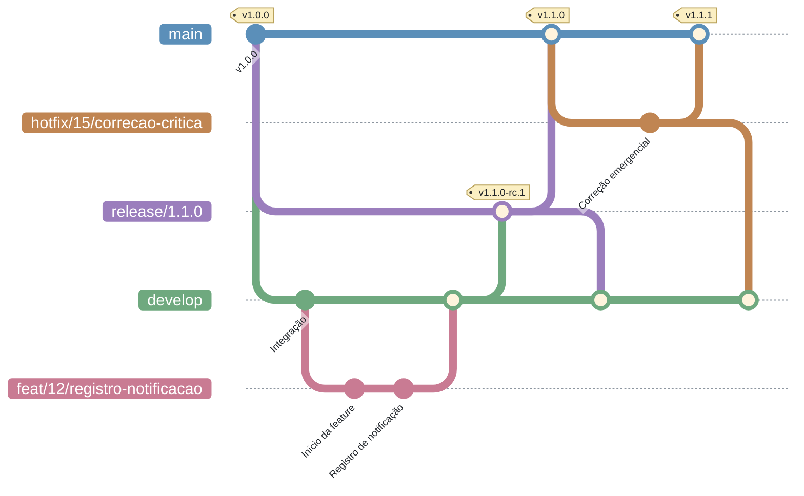

<h1 align="center">Modelo de Ramificação</h1>


<p align="center">O histórico de alterações consolidado está na <a href="../">página inicial da seção de GCS</a>.</p>

## Sumário

- [1. Introdução](#introducao)
- [2. Diagrama do fluxo](#diagrama)
- [3. Princípios-chave](#principios)
- [4. Branches](#branches)
- [5. Como usar](#como-usar)
- [6. Padronização da nomenclatura](#nomenclatura)
- [7. Repositórios de apoio](#repositorios-apoio)

---

<a id="introducao"></a>

## 1. Introdução

O modelo de ramificação adotado no projeto Notifica Saúde é o **GitFlow**. Trata-se de um fluxo de trabalho para desenvolvimento de software com o sistema de controle de versão **Git**, organizado em torno de duas branches principais de vida longa — `main` e `develop` — e de branches temporárias destinadas ao desenvolvimento de funcionalidades, a correções e à preparação de releases.

---

<a id="diagrama"></a>

## 2. Diagrama do fluxo

O diagrama abaixo representa o ciclo adotado pela equipe: as funcionalidades partem da `develop`, retornam a ela por Pull Request, são promovidas para uma branch de `release` para validação e, somente então, integradas à `main`. As correções emergenciais (*hotfix*) partem da `main` e retornam à `main` e à `develop`, conforme descrito em [Pull Requests não planejadas](pull-requests.md#nao-planejadas).



---

<a id="principios"></a>

## 3. Princípios-chave

| Princípio | Descrição |
| --- | --- |
| **Branch principal** | O desenvolvimento é integrado na branch `develop`, enquanto a branch `main` sempre contém código estável e pronto para produção. |
| **Branches de trabalho** | Cada nova funcionalidade é desenvolvida em uma *feature branch* criada a partir da `develop`. Isso isola o desenvolvimento e facilita a integração contínua na branch de desenvolvimento. |
| **Commits frequentes** | Os desenvolvedores devem realizar commits frequentes em suas branches, registrando o progresso e facilitando o acompanhamento das alterações. |
| **Pull Requests** | Concluído o trabalho em uma funcionalidade, abre-se um Pull Request para a `develop`, onde a alteração é revisada e discutida antes da integração. Quando há uma versão estável pronta para produção, abre-se um Pull Request da branch de release para a `main`. |
| **Revisões de código** | Os membros da equipe analisam o código enviado no Pull Request, sugerindo melhorias, solicitando ajustes ou aprovando as alterações, o que ajuda a garantir a qualidade do código e a colaboração entre os desenvolvedores. |
| **Deploy contínuo** | O merge para a `main` ocorre apenas por meio de releases originadas da `develop`, garantindo que somente versões validadas cheguem à produção. |

---

<a id="branches"></a>

## 4. Branches

Guia rápido sobre as branches do modelo GitFlow no projeto:

| Branch | Descrição |
| --- | --- |
| **`main`** | Branch principal do projeto. Deve sempre conter uma versão estável do sistema. Recebe integrações apenas a partir de branches de release provenientes da `develop` ou de branches de *hotfix*. |
| **`hotfix`** | Branch temporária criada a partir da `main` para corrigir falhas críticas em produção que não podem aguardar o ciclo normal de release. Após a aprovação do Pull Request, é mesclada na `main` e na `develop` simultaneamente, garantindo que a correção não se perca na próxima release, e pode ser removida. |
| **`develop`** | Branch de integração contínua e testes. Reúne e valida coletivamente todas as novas funcionalidades e melhorias desenvolvidas nas *feature branches*, antes que sejam promovidas para a branch de release. |
| **`release`** | Branch temporária utilizada para preparar o lançamento de uma nova versão de produção. Permite ao QA realizar testes em uma versão estável do sistema antes da integração com a `main`. |
| ***feature branches*** | Branches temporárias criadas a partir da `develop` para desenvolver novas funcionalidades, melhorias ou correções de bugs. Após a conclusão do trabalho e a aprovação do Pull Request, são mescladas de volta na `develop` e podem ser removidas. |

---

<a id="como-usar"></a>

## 5. Como usar

Para realizar qualquer alteração no projeto utilizando o **GitFlow**, siga os passos abaixo:

1. **Crie uma nova ramificação.** Ao iniciar uma nova funcionalidade ou correção, crie uma branch a partir da `develop`. Exemplo de nome válido: `feat/123/adiciona-header`, em que `feat` representa o tipo da branch, `123` o número da issue e `adiciona-header` uma breve descrição da atividade. Os detalhes estão na seção [Padronização da nomenclatura](#nomenclatura).

2. **Implemente as alterações.** Realize as modificações necessárias dentro da sua branch. Recomenda-se realizar commits frequentes e descritivos, mantendo um histórico claro das alterações. Sempre que possível, teste suas alterações para garantir que não introduzam erros no projeto.

3. **Envie a branch para o repositório remoto.** Após realizar os commits localmente, publique sua branch para que os demais membros da equipe possam acompanhar o progresso do trabalho.

4. **Abra um Pull Request.** Quando a funcionalidade estiver pronta para revisão, abra um Pull Request para que as alterações sejam avaliadas pelos outros membros da equipe.

5. **Participe da revisão.** Durante o processo de revisão, os membros da equipe podem comentar, sugerir melhorias ou solicitar ajustes. Caso necessário, faça novas alterações e atualize o Pull Request.

6. **Obtenha a aprovação.** Pelo menos um membro da equipe deve revisar e aprovar o Pull Request antes que ele possa ser integrado à `develop`.

7. **Realize o merge.** Após as aprovações necessárias e a verificação de que todos os testes passaram, o Pull Request pode ser mesclado na `develop`. Validado o código na `develop`, ele segue para a branch de release e, então, é integrado à `main`, conforme o ciclo descrito em [Gerenciamento de Releases](gerenciamento-releases.md). Concluída a integração, a *feature branch* pode ser removida.

---

<a id="nomenclatura"></a>

## 6. Padronização da nomenclatura

Para manter uma organização consistente das ramificações, o nome da branch deve começar com o tipo da atividade, seguido do número da issue e de uma breve descrição da tarefa. O tipo da ramificação deve ser definido e escrito da mesma maneira que no [padrão de mensagens de commit](padrao-commits.md#tipo).

```
<tipo da ramificação>/<número da issue>/<descrição>
```

O nome da ramificação deve conter apenas caracteres alfanuméricos em minúsculo. A separação entre palavras deve ser feita com o caractere `-` (hífen).

**Exemplo:** `feat/12/adiciona-header`

---

<a id="repositorios-apoio"></a>

## 7. Repositórios de apoio

O modelo GitFlow descrito nas seções anteriores aplica-se aos repositórios de aplicação (`notifica-saude-frontend` e `notifica-saude-backend`), que possuem ciclo de release e código em produção.

Os repositórios de apoio — [notifica-saude-e2e](https://github.com/Notifica-Saude-2026-2/notifica-saude-e2e), [notifica-saude-deploy](https://github.com/Notifica-Saude-2026-2/notifica-saude-deploy), [notifica-saude-docs](https://github.com/Notifica-Saude-2026-2/notifica-saude-docs) e [notifica-saude-prototipo-funcional](https://github.com/Notifica-Saude-2026-2/notifica-saude-prototipo-funcional) — não seguem esse fluxo. Neles adota-se um modelo simplificado, composto apenas pela branch `main` e por *feature branches*:

- a `main` é a única branch permanente e concentra a versão vigente do conteúdo;
- cada alteração é feita em uma *feature branch* criada a partir da `main`;
- a integração ocorre por Pull Request diretamente para a `main`, sujeito às mesmas regras de revisão descritas em [Gerenciamento de Pull Requests](pull-requests.md);
- concluído o merge, a *feature branch* pode ser removida.

Não existem branches de `develop`, `release` ou `hotfix` nesses repositórios, uma vez que não há ciclo de versionamento de produto a ser preparado. A [padronização da nomenclatura](#nomenclatura) e o [padrão de mensagens de commit](padrao-commits.md) permanecem obrigatórios.
