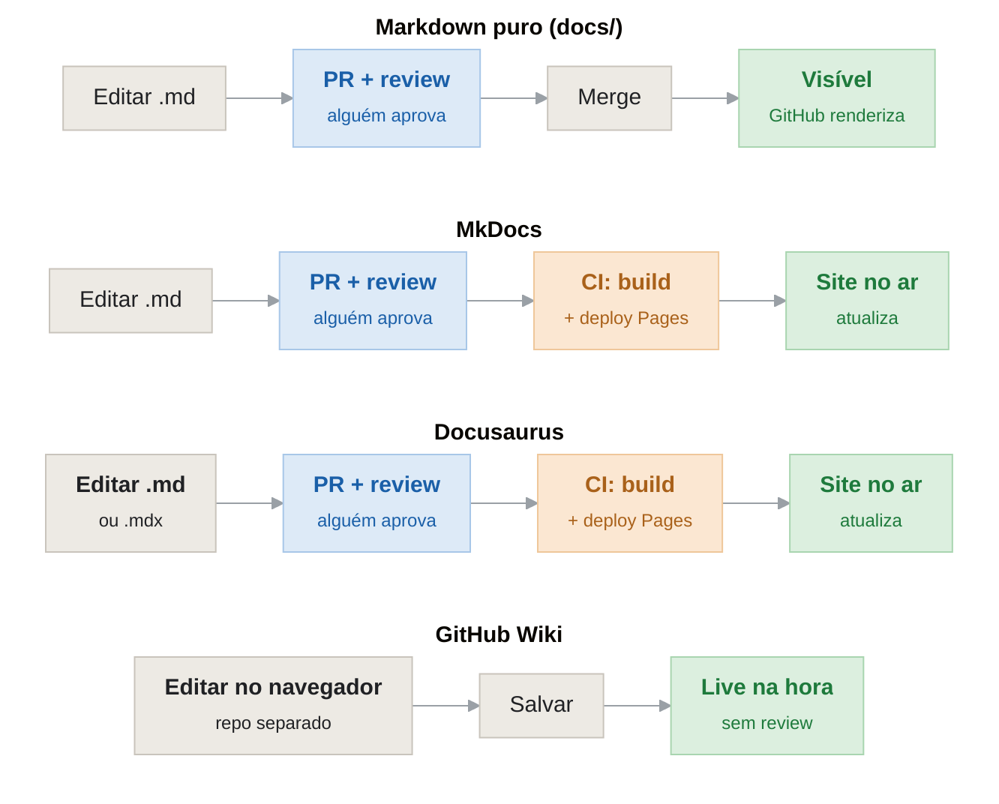

<h1 align="center">Centralização da Documentação no GitHub Pages</h1>

<strong>Sistema Notifica Saúde — Versão 1.2</strong>

<strong>Mantenedores:</strong> Gustavo Henrique, Kauan Cardoso, Sophya Ribeiro, Brenno, Catarina, Eduardo

??? note "Histórico de Alterações"

    | Versão | Data | Justificativa | Responsável |
    | --- | --- | --- | --- |
    | 1.0 | 06/08/2026 | Documentar ferramentas elencadas como opção, trade-offs e fluxo de atualização de cada uma. | Catarina Freisleben |
    | 1.1 | 07/08/2026 | Documentar a escolha para o projeto. | Catarina Freisleben |
    | 1.2 | 20/08/2026 | Revisão geral do documento e migração para o site de documentação. | Catarina Freisleben |

## Sumário

- [1. Contexto](#contexto)
- [2. Ferramentas: o que é necessário e trade-offs](#ferramentas)
- [3. Fluxo de atualização por ferramenta](#fluxo-atualizacao)
- [4. Diagrama dos fluxos de utilização](#diagrama)
- [5. Definição](#definicao)

---

## 1. Contexto

Os documentos do projeto estão em diferentes plataformas. O objetivo é centralizar esse conteúdo no GitHub como arquivos `.md`. Este documento resume as opções elencadas e avaliadas, o que cada uma exige, seus trade-offs e o fluxo de atualização de cada uma.

---

## 2. Ferramentas: o que é necessário e trade-offs

O fator predominante na avaliação foi a atualização e o armazenamento da documentação.

| Ferramenta | O que é necessário | Trade-off |
| --- | --- | --- |
| **Markdown puro** | Git e arquivos `.md` em uma pasta `/docs` no repositório do código. O GitHub já renderiza. | Não é um site — para um documento grande, fica cansativo de navegar. Processo de migração e atualização mais simples. |
| **MkDocs** | Python no ambiente, um `mkdocs.yml` e os arquivos `.md`. Possui passo de build e deploy (no GitHub Pages). | Exige Python e um passo de build/deploy. Menos flexível que o Docusaurus para configurações avançadas. Curva de aprendizado baixa, tema visualmente adequado, gera site com busca. |
| **Docusaurus** | Node/React no ambiente e configuração mais extensa. Suporta configurações mais avançadas. | Mais peso e configuração. Necessário conhecimento do ecossistema JS. Gera site com busca e mais personalização. |
| **GitHub Wiki** | Nada a instalar. Edita pelo navegador, sem build, sem deploy. Vive em um repositório separado do código. | Sai do fluxo de PR/review — o histórico e a estrutura ficam mais frágeis. Proporciona navegação semelhante à de um site, dentro do próprio GitHub. |

---

## 3. Fluxo de atualização por ferramenta

A parte de editar é praticamente idêntica nas quatro opções: em todas, mexe-se em um arquivo `.md`. O que muda é o que acontece depois de salvar o `.md`: se passa por review (PR), se há um passo de build/deploy, e onde o resultado aparece.

**Markdown puro**

Editar o `.md`, abrir PR, review e merge. Acabou: o GitHub já renderiza o arquivo, não existe passo de publicação. A documentação é o próprio arquivo no repositório.

**MkDocs**

A edição é igual. A diferença: após o merge, um CI roda o build (transforma os `.md` em site HTML) e publica no GitHub Pages. Fluxo: editar (opcionalmente, usar o comando `mkdocs serve` para pré-visualizar localmente) → PR → merge → build e deploy → site atualizado.

**Docusaurus**

Da mesma forma que o MkDocs, muda apenas a linguagem (Node em vez de Python) e o peso do build. Passo extra exclusivo: se for usado versionamento de docs, há um comando para "congelar" uma versão (snapshot da documentação atual).

**GitHub Wiki**

Fluxo mais curto e mais diferente: editar direto no navegador, salvar, e já está no ar. Sem build, sem PR, sem review. Problema: repositório separado do código, e ninguém revisa antes de atualizar.

---

## 4. Diagrama dos fluxos de utilização

As três primeiras opções compartilham o passo de review (PR). MkDocs e Docusaurus adicionam o passo de build/deploy; o Markdown puro pula direto para "visível", porque o GitHub já renderiza o arquivo. O GitHub Wiki publica direto, sem review e sem versionamento.

---

## 5. Definição

Em reunião, foi definido que será utilizado o MkDocs para a migração e organização da documentação do projeto. A escolha da ferramenta foi baseada em três fatores: a facilidade de build e deploy, o objetivo de disponibilizar a documentação em formato de site e a curva de aprendizado relativamente baixa da ferramenta.

O GitHub Wiki não foi escolhido por não oferecer a rastreabilidade desejada para o acompanhamento das alterações na documentação. O uso de Markdown puro também foi descartado, pois, apesar de sua simplicidade, não atende ao objetivo de disponibilizar a documentação em um formato estruturado e com aparência de site. O Docusaurus não foi adotado devido à sua maior curva de aprendizado e à necessidade de evitar um investimento excessivo de tempo na configuração e manutenção da documentação.

Dessa forma, o MkDocs foi considerado a alternativa que melhor atende às necessidades do projeto, conciliando praticidade, organização e facilidade de manutenção.