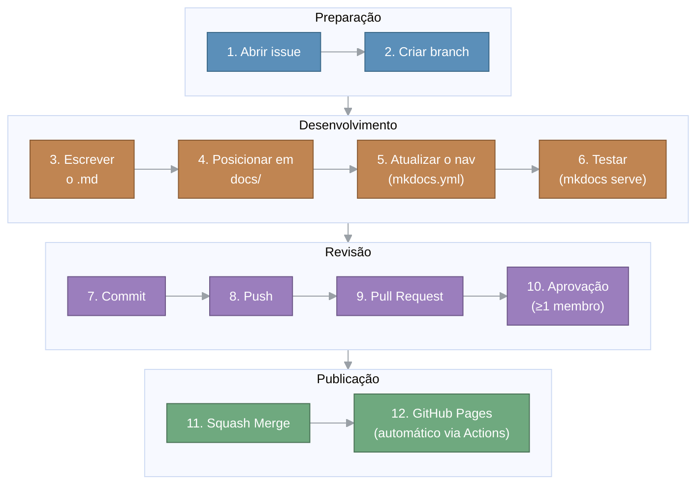

<h1 align="center">Guia de Atualização da Documentação</h1>

<p align="center"><strong>Sistema Notifica Saúde — Versão 1.3</strong></p>

<p align="center"><strong>Mantenedores:</strong> Gustavo Henrique, Kauan Cardoso, Sophya Ribeiro, Brenno, Catarina, Eduardo</p>

??? note "Histórico de Alterações"

    | Versão | Data | Justificativa | Responsável |
    | --- | --- | --- | --- |
    | 1.0 | 11/08/2026 | Inclusão da visão geral, das premissas e dos pré-requisitos do ambiente. | Catarina Freisleben |
    | 1.1 | 12/08/2026 | Descrição do passo a passo para executar o ambiente. | Catarina Freisleben |
    | 1.2 | 13/08/2026 | Detalhamento da publicação no GitHub Pages, incluindo o fluxo automático e o fluxo manual de contingência. | Catarina Freisleben |
    | 1.3 | 20/08/2026 | Revisão geral do documento e migração para o site de documentação. | Catarina Freisleben |

## Sumário

- [1. Visão Geral](#visao-geral)
- [2. Premissas](#premissas)
- [3. Fluxo](#fluxo)
- [4. Passo a Passo](#passo-a-passo)
    - [4.1. Abrir uma issue](#passo-issue)
    - [4.2. Criar uma branch a partir da main](#passo-branch)
    - [4.3. Converter ou criar o arquivo .md](#passo-arquivo)
    - [4.4. Posicionar o arquivo na pasta certa](#passo-pasta)
    - [4.5. Manter o histórico de versão dentro da página](#passo-historico)
    - [4.6. Registrar a página no nav do mkdocs.yml](#passo-nav)
    - [4.7. Testar localmente](#passo-testar)
    - [4.8. Commit segundo o padrão GCS](#passo-commit)
    - [4.9. Enviar a branch e abrir o Pull Request](#passo-pr)
    - [4.10. Publicar no GitHub Pages](#passo-publicar)
- [5. Conclusão](#conclusao)

---

<a id="visao-geral"></a>

## 1. Visão Geral

Este documento descreve os passos necessários para incluir um documento no repositório `notifica-saude-docs`, seguindo o padrão de Gerência de Configuração de Software (GCS). O `notifica-saude-docs` concentra toda a documentação do projeto Notifica Saúde, estilizada como um site de documentação real usando MkDocs com o tema Material for MkDocs.

---

<a id="premissas"></a>

## 2. Premissas

Nesta seção, são descritas as premissas do documento. As premissas definem condições que devem ser satisfeitas para que a configuração do ambiente seja realmente exequível.

| Tipo | Descrição |
| --- | --- |
| Premissa | Conta no GitHub com acesso à organização `Notifica-Saude-2026-2` |
| Premissa | Git instalado localmente e autenticado |
| Premissa | Ambiente local configurado e com acesso ao repositório `notifica-saude-docs`, como descrito no Guia de Configuração do Ambiente |

---

<a id="fluxo"></a>

## 3. Fluxo

O processo descrito no plano de GCS define que toda alteração parte de uma issue, é feita numa branch separada localmente e é integrada à `main` via Pull Request revisado.



---

<a id="passo-a-passo"></a>

## 4. Passo a Passo

Dado que as premissas e os pré-requisitos estão configurados, para incluir uma alteração no site de documentação é necessário:

<a id="passo-issue"></a>

### 4.1. Abrir uma issue

Antes de iniciar qualquer alteração, é necessário registrar no GitHub o que será feito, por meio de issues. O motivo dessa política é a rastreabilidade, pois permite que a equipe acompanhe o que está sendo feito. Em seguida, o nome da branch utilizada para fazer a alteração deverá conter o número dessa issue.

<a id="passo-branch"></a>

### 4.2. Criar uma branch a partir da main

Execute os comandos a seguir para atualizar a `main` local:

```powershell
git checkout main
git pull origin main
```

Em seguida, execute o comando para criar a branch e mudar para ela:

```powershell
git checkout -b <tipo>/<numero-da-issue>/<descricao-com-hifens>
```

Padrão de nome da branch: `<tipo>/<número-da-issue>/<descrição-com-hífens>`. Como este repositório é só documentação, o `<tipo>` normalmente será `docs`, mas, caso não seja, é necessário verificar qual tipo se aplica no documento de GCS.

<a id="passo-arquivo"></a>

### 4.3. Converter ou criar o arquivo .md

É necessário converter o documento de origem caso ele seja de um tipo diferente de `.md`. Caso seja um documento novo, crie o arquivo diretamente em Markdown.

<a id="passo-pasta"></a>

### 4.4. Posicionar o arquivo na pasta certa

Encontre a pasta correta (`docs/…`) para o posicionamento do arquivo. O local em que ele for armazenado será onde o arquivo será apresentado no site. É possível, no arquivo `mkdocs.yml`, verificar em qual parte do `nav` o arquivo se encaixa.

Nomeie o arquivo em `kebab-case` minúsculo, descritivo do conteúdo (por exemplo, `especificacao-requisitos.md`, e não `DOC_Requisitos_v2.7.md`). O nome do arquivo vira parte da URL, por isso precisa ser legível e simples.

<a id="passo-historico"></a>

### 4.5. Manter o histórico de versão dentro da página

A GCS exige que todo documento tenha uma seção de histórico de alterações, que nunca deve ser removida. Por padrão adotado no site, essa seção fica em um bloco recolhível, posicionado logo após o título e antes do Sumário:

````markdown
??? note "Histórico de Alterações"

    | Versão | Data | Justificativa | Responsável |
    | ------ | ---- | ------------- | ----------- |
    | 2.7 | 15/08/2026 | Migração para o site de documentação MkDocs | Seu Nome |
````

<a id="passo-nav"></a>

### 4.6. Registrar a página no nav do mkdocs.yml

Se foi criada uma página nova dentro de uma categoria que já existe no `nav`, edite o `mkdocs.yml` e adicione a entrada correspondente. Exemplo, adicionando uma subpágina dentro de "Requisitos":

```yaml
nav:
  - Requisitos:
      - Visão geral: requisitos/index.md
      - Especificação de Requisitos: requisitos/especificacao-requisitos.md
```

!!! note "Por que esse passo importa"
    O MkDocs só mostra na navegação lateral os arquivos listados em `nav:`. Um arquivo `.md` dentro de `docs/` que não está no `nav` existe no site (fica acessível por URL direta), mas não aparece no menu.

<a id="passo-testar"></a>

### 4.7. Testar localmente

Ative o ambiente virtual:

```powershell
.venv\Scripts\Activate.ps1
```

E, para testar localmente:

```powershell
mkdocs serve
```

Abra `http://127.0.0.1:8000`, navegue até a página nova ou atualizada e confira o que foi alterado.

<a id="passo-commit"></a>

### 4.8. Commit segundo o padrão GCS

Formato `<tipo>: <assunto>`. Deve ser em minúsculo, com o assunto começando por um verbo no presente. É necessário verificar qual `<tipo>` se aplica antes de commitar. Exemplo:

```powershell
git add .
git commit -m "docs: adiciona especificacao de requisitos v2.7"
```

<a id="passo-pr"></a>

### 4.9. Enviar a branch e abrir o Pull Request

Envie a branch para o GitHub por meio do comando `git push`, por exemplo:

```powershell
git push -u origin docs/7/adiciona-requisitos-v2.7
```

O título do PR deve ser igual ao commit principal, e o corpo deve referenciar a issue com `Closes #<número>`, para que ela seja fechada automaticamente quando o PR for mesclado. Feito isso, abra o Pull Request para a `main`.

A branch deve ser apagada após o merge. Depois do merge, atualize a cópia local da `main`:

```powershell
git checkout main
git pull origin main
```

<a id="passo-publicar"></a>

### 4.10. Publicar no GitHub Pages

O GitHub Pages não interpreta `mkdocs.yml` nem `docs/*.md` diretamente — ele serve arquivos estáticos já prontos (HTML/CSS/JS). Esse HTML compilado fica na pasta `site/`, que está no `.gitignore` e por isso nunca vai para a branch `main`. Para publicar, o conteúdo de `site/` precisa ir para uma branch separada, chamada por convenção `gh-pages`, que é a que o GitHub Pages efetivamente serve. O MkDocs tem um comando pronto para isso, `mkdocs gh-deploy`, que builda o site e o envia diretamente para essa branch.

Existem duas formas de realizar essa publicação: uma automática, que é o padrão adotado pelo projeto, e uma manual, usada apenas como contingência.

#### 4.10.1. Publicação automática

Assim que o Pull Request é mesclado (squash merge) na `main`, um workflow do GitHub Actions é disparado automaticamente: ele builda o site com o MkDocs e publica o resultado na branch `gh-pages`. **Não é necessário executar nenhum comando** — a publicação ocorre sozinha, poucos minutos após o merge.

#### 4.10.2. Publicação manual (plano B)

Caso o workflow automático falhe por algum motivo (por exemplo, uma instabilidade no GitHub Actions ou um erro de configuração), ou caso seja necessário testar uma publicação sem depender de um merge, é possível publicar manualmente com os mesmos comandos usados antes de a automação existir:

```powershell
git checkout main
git pull origin main
.venv\Scripts\Activate.ps1
mkdocs gh-deploy
```

Esse comando builda o site localmente e envia o resultado direto para a branch `gh-pages`, exatamente como o workflow automático faz — a diferença é que aqui a execução parte da sua máquina.

#### 4.10.3. Por que existem duas formas de publicar

A publicação automática é o fluxo padrão porque elimina o risco de alguém esquecer de publicar depois de aprovar e mesclar um PR — sem ela, o PR poderia ser aprovado e o site continuar desatualizado, sem nenhum aviso disso. Já a publicação manual continua existindo como plano B: é o mesmo comando de sempre, não depende de o GitHub Actions estar funcionando, e serve tanto para contornar uma falha pontual da automação quanto para publicar uma versão de teste sem precisar abrir e mesclar um Pull Request.

#### 4.10.4. Por que uma branch separada, e não a própria main?

A `main` tem o código-fonte, não o site pronto. Nela estão o `mkdocs.yml`, os arquivos `.md` em `docs/`, o `.venv`, entre outros — o navegador não consegue exibir isso diretamente. O GitHub Pages precisa de HTML/CSS/JS já compilados, que é justamente o que o `mkdocs build` gera dentro da pasta `site/` (a mesma que está no `.gitignore`).

Seria possível commitar o `site/` também na `main`, mas isso não é recomendado: a cada `.md` editado, seria preciso gerar o build e commitar os dois (fonte e gerado) juntos na mesma branch, misturando "o que foi escrito" com "o que foi gerado automaticamente" no mesmo histórico. Isso polui o histórico de commits com diffs gigantes de HTML minificado a cada mudança, além de misturar duas responsabilidades diferentes.

Por isso existe a `gh-pages`: uma branch que não guarda código-fonte, apenas o resultado do build (o conteúdo de `site/`), e que é substituída inteira a cada `mkdocs gh-deploy` (seja automático ou manual), por meio de um force-push. O GitHub Pages é configurado para servir arquivos estáticos justamente a partir dessa branch. Assim:

- `main` = histórico limpo, só com o que foi realmente escrito;
- `gh-pages` = apenas o "produto final" pronto para a internet, descartável e regenerável a qualquer momento a partir da `main`.

---

<a id="conclusao"></a>

## 5. Conclusão

A partir desse ponto, é possível editar ou criar arquivos `.md` na pasta `docs/`. Toda mudança enviada ao repositório deve seguir o fluxo de Gerência de Configuração de Software (GCS) do projeto (issue → branch → commits → Pull Request → aprovação → squash merge). O passo a passo completo está descrito na [Seção 4](#passo-a-passo) deste documento.

A publicação do site (GitHub Pages) é automática a partir do merge na `main`, conforme descrito na [Seção 4.10](#passo-publicar). Havendo qualquer falha nesse processo automático, a Seção 4.10.2 descreve o procedimento manual de contingência.